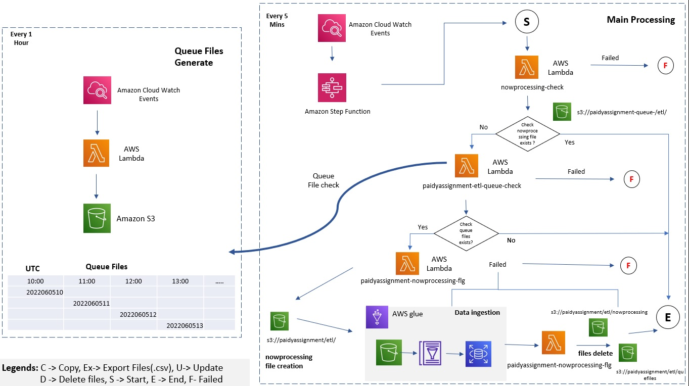

# Paidy Data Engineer Take Home Assignment

Problem Statement can be found [here](https://github.com/paidy/dsf-interview/tree/main/dse).

# Part 1: Data Ingestion

## Assumptions

1. The infrastructure is in the cloud, and AWS is used for this assignment.
2. Initial setup of AWS is already completed.
    - AWS User Setup
    - VPC and Subnet Setup
    - Security Group Setup
    - IAM Setup
    - Endpoint setup(Glue, S3, System Manager)
3. Source files are in the same format as [sample.csv](https://github.com/paidy/dsf-interview/blob/main/dse/sample_data.csv).
4. The files will be pushed by 3rd party software in S3.
5. All files are new files and no files are updated.
6. The file path should follow below pattern.
    ```
    yyyy=year/mm=month/dd=date/hh=hour/{file_name}.csv
    eg.
    yyyy=2022/mm=06/dd=05/hh=12/file001.csv
    yyyy=2022/mm=06/dd=05/hh=12/file002.csv
    ```
7. The file data should be comma-separated(,).
8. Data ingestion frequency is hourly.

## Data Pipeline Architecture



### There are 3 parts in Data Pipeline

    - Queue files generator
      It generates queue files for a new job and places them in the queue available in S3.
    - Main Processing 
      It checks whether the data ingestion job already running for another queue
         No, the latest job from the queue will be picked for data ingestion.
         Yes, exit out without processing anything.    
    - Data Ingestion
      - It checks source files available in s3 and then creates AWS Glue Data Catalog.
      - AWS Glue accesses the Data Catalog and creates Glue Dynamic Frame. (Current Job will load 1 hour prior data. Eg. 2022/06/05 10:00:00 AM job run will load 2022/06/05 09:01:00~09:59:00 AM)
      - After the transformation of data(Here, NA are converted to Null), it will be loaded into the MYSQL database.

## Data Pipeline Resource Creation

Note: For this PoC, minimal compute cost AWS resources are used.

1. Check AWS Glue, S3, RDS, Lambda, Stepfunction, IAM, and Cloudwatch access.

2. Create AWS RDS MySQL free tier.(For more information : Refer [Link](https://aws.amazon.com/getting-started/hands-on/create-mysql-db/))

3. Create AWS Glue Connection under AWS console for RDS-MYSQL.
4. Create AWS job as per the code placed [here](./Code/Glue/data_ingestion.py).
5. Create AWS Lambda function ```queuefiles_generate```.(Refer Code: [Here](./Code/Lambda/queuefiles-generate.py))
    - Create ```parameter_store_prefix``` environment variable.(Under Configuration->Environment Variables)
6. Create AWS Lambda function ```nowprocessing_check```.(Refer Code: [Here](./Code/Lambda/nowprocessing-check.py))
7. Create AWS Lambda function ```nowprocessing_flg```.(Refer Code: [Here](./Code/Lambda/nowprocessing-flg.py))
8. Create AWS Lambda function ```etl_queue_check```.(Refer Code: [Here](./Code/Lambda/etl-queue-check.py))
9. Create AWS Stepfunction for data ingestion workflow.(Refer JSON:[Here](./Code/Stepfunction/data-ingestion-workflow.json))
    - Replace ARN and resource name marked as ```TO BE REPLACED```.
10. Create AWS Cloudwatch Event ```queuefile-generate-trigger``` as schedule event with below pattern.
    ```bash
    0/00 * * * ? *
    ```
11. Create AWS Cloudwatch Event ```data-pipeline-trigger``` as schedule event with the below pattern.
    ```bash
    0/5 * * * ? *
    ```
12. Create parameter store as per sheet can be found [here](./Code/SSM/data-pipeline-parameter.xlsx).

13. Create an s3 bucket as ```paidyassignment-aws-glue```
14. Create prefixes under above S3 mentioned below.
    ```
        athena/
        etl/
        library/
        paidyassignment_source_files/
        queuefiles/
        script/
        temp/
    ```
15. Open Athena editor, and create source database and tables using SQL found [here](./Code/SQL/SQL_Source_DB_Table.sql).
16. Open SQL editor, and create target database and tables using SQL found [here](./Code/SQL/SQL_Target_DB_Table.sql).
17. Download the JDBC driver found [here](./mysql-connector-java-8.0.29.jar) and place it under ```library/``` folder created in step 14.

## Runbook

1. Make sure Source tables and Target tables are created.
2. Make sure all resource creation is completed.
3. Make sure Cloudwatch Events are enabled.
4. Monitor Stpefunction status. 
5. Get the source count using athena editor and match it with the source count loaded into the target.


## Challenges and Improvement

1. Network connection can be a challenge.
2. MySQL DB connection can be a challenge.
3. Automatic Restartibility can be implemented in subsequent versions.
4. Database Backup and recovery can be implemented.

# Part 2: Understanding the Data

An exploratory data analysis is created in a Jupyter notebook. Please find the file [here](./eda-paidyassignment.ipynb).

The notebook is divided into different parts which helps to comprehend the data insights with proper data preprocessing needed. Please have look at the notebook.

Note : Please configure MySQL details in dbconnection.py file.Refer file [here]()